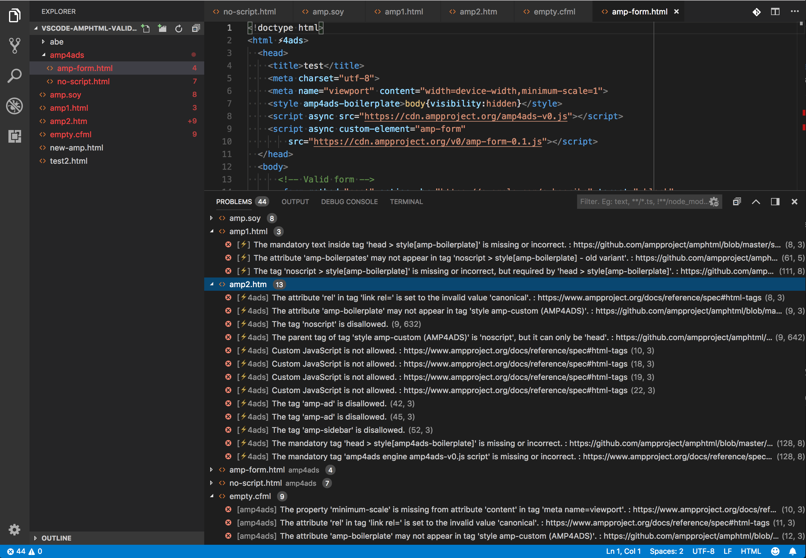
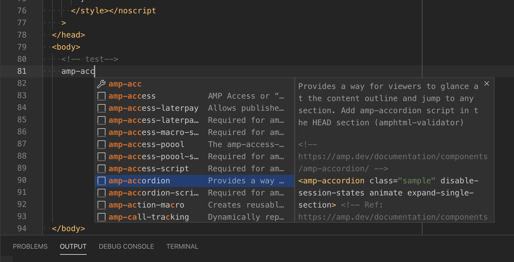

# Visual Studio Code extension for AMP Validator & Snippets

This extension makes authoring AMP documents, easy by validating for
errors/warnings as you type within Visual Studio Code editor.
The **PROBLEMS** (View->Problems) panel renders the
AMP validation error/warning messages with the row and column number in
the document from where errors/warnings were reported.

Related row is focused in the editor when an error/warning is selected.
Hovering over the error in the editor reveals a tooltip with error details.

This version also adds Snippets for all the AMP components and scripts.
Start typing amp- and the autocomplete will show available components and scripts.

This extension uses AMP validator available at:
[AMP Validator](https://www.npmjs.com/package/amphtml-validator).
This extension uses amphtml-validator version: **1.0.35**

Current implementation of amphtml-validator package fetches the latest version
of validator.js from [CDN](https://cdn.ampproject.org/v0/validator.js), so
this extension requires internet connection.
[Issue #12](https://github.com/diparikh-project/vscode-amphtml-validator/issues/12) is open to make this extension work offline.

**How to use AMP Validator extension**

After installing the extension from
[VS Code Marketplace](https://marketplace.visualstudio.com/items?itemName=amphtml.amphtml-validator), the
extension is activated when `HTML` file is opened. If extension finds one of
the AMP specific attributes(shown below) defined in `<html>` tag, executes the
AMP validator for the document and renders the errors/warnings as
reported by validator in the **PROBLEMS** panel, if any.

Following are all examples of valid AMP documents

- `<html ⚡>`
- `<html lang="en" ⚡>`
- `<html ⚡4ads>`
- `<html amp4ads lang="en">`
- `<html ⚡4email>`
- `<html amp="" id="a">`

Full list of valid AMP attributes are:
`⚡|amp|⚡4ads|amp4ads|⚡4email|amp4email` (case insensitive)

All AMP validator Errors/Warnings are reported in **PROBLEMS** view
(Open the panel by `View->Problems`, if not already opened).

Issues are removed from the **PROBLEMS** panel when fixed in the editor.

Each AMP validation error/warning row has 3 parts as under:

`[<TYPE>] <ERROR_MESSAGE> : <LINK> (LINE_NUM, COLUMN_NUM)`

- `TYPE:` AMP document type as defined in `<html>` tag.
- `ERROR_MESSAGE`: The error/warning message as reported by the AMP validator.
- `DOCUMENTATION_LINK`: Link to AMP documentation about this error.
- `(LINE_NUM, COLUMN_NUM)`: Starting location of the error in the editor.

The **PROBLEMS** panel might render other errors/warnings
(such as `html`, `css`) since, VS Code has build-in support for validating
`html` and `css`, or you might have installed other extensions for
additional validations of `html` documents. Each error reported by the
various extensions on the same document will have different `TYPE`.

Note that number of Errors/Warnings are also rendered in the `File Explorer`
for a quick view of Errors/Warnings across all opened files. The total
number of errors/warnings includes `AMP`, `HTML` and `CSS`
errors/warnings. This may also include errors/warnings reported by other
extensions.

## Sample AMP Validator extension in action



The above screenshot renders the **PROBLEMS** panel with all `errors`/ `warnings`
across all open files. The `file explorer` also renders the numbers of
errors shown next to the file name.

---



The above screen renders the auto-complete option available when "amp-acc" is keyed-in.

All the "amp-\*" components and corresponding "amp-\*-script" options are available for the auto-complete.

(**Note:** Snippets can be disabled by installing 'Control Snippets' or similar extension and disabling `amphtml-validator` snippets.)

# FAQ

## Q. What are other options if I am not using VS Code as an editor?

> AMP HTML has multiple options to validate the documents
> [See Details](https://www.ampproject.org/docs/fundamentals/validate)
>
> 1. [In Browser validator](https://validator.ampproject.org/)
> 2. URL: #development=1 (Chrome DevTools console)
> 3. [Browser extension](https://chrome.google.com/webstore/detail/amp-validator/nmoffdblmcmgeicmolmhobpoocbbmknc?hl=en) (Chrome & Opera)
> 4. npm package (https://www.npmjs.com/package/amphtml-validator)
> 5. gulp task [gulp-amp-html-validator](https://www.npmjs.com/package/gulp-amphtml-validator)
> 6. [Playground](https://ampbyexample.com/playground/)
> 7. [AMP Bin](https://ampb.in/)

## Q. Will there be any performance implications due to this extension?

> This extension is using the [Language Server Protocol](https://microsoft.github.io/language-server-protocol/),
> which run in its own process to avoid performance cost.

## Q. What file types are supported?

> AMP HTML documents are `HTML` douments and by default VS Code supports
> `.html` and `.htm` file extensions but VS Code can be extended to support
> HTML files with other extensions:
>
> ```json
>     "files.associations": {
>         "*.tpl": "html",
>         "*.hbs": "html"
>     },
> ```
>
> Adding above VS Code setting (`Code -> Preferences -> Settings`)
> will allow `.tpl` and `.hbs` file types for AMP HTML validation.

## Q. Any plans to support other editors?

> Since the extension is developed using the [Language Server Protocol](https://microsoft.github.io/language-server-protocol/), it would be possible
> to reuse the Language Server and develop extension/plugin for other
> [Language Server Protocol](https://microsoft.github.io/language-server-protocol/)
> supported editors in the future.
> Currently there are no near future plans to support other editors but
> discussion is underway to see how this effort can be extended for other
> popular editors. Atom could be the next one.

## Q. amphtml has a lot of snippets. Can I turn off if not using?

> Visual Studio Code, currently does not have features to turn off snippets
> but there are extensions available to turn off specific snippets.
> One such extension we have tried and seems working as expected is `"Control Snippets"`.

## Q. Can I configure this extension?

> The following two settings will be available in the future.
> [issue #13](https://github.com/diparikh-project/vscode-amphtml-validator/issues/13)
>
> `**PENDING IMPLEMENTATION**`
>
> Settings are available to change how this extension responds.
> (Use Code->Preferences->Settings to activate VS Code settings editor)
>
> Enable/Disable AMP HTML validation without uninstall
>
> - `"amphtml.validator.enabled": true|false` // Default: `true`
>
> Keep/Remove AMP validation errors after closing the document
>
> - `"amphtml.validator.keepIssuesAfterDocumentClose": false` //Default:`true`
